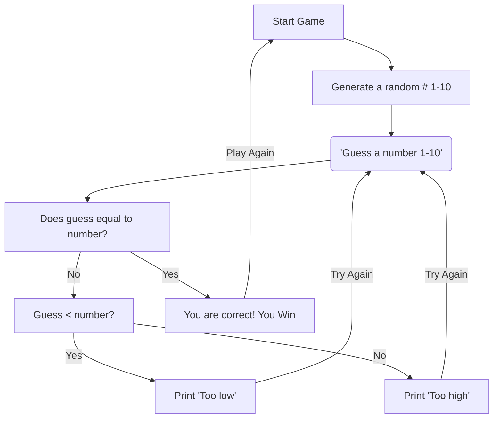

- Step 1: User Starts the game and the game generates a random number 1-10
- Step 2: User guesses a number through 1-10
- Step 3: The game finds out if the guess is equal to the generated number
    - If so then the game prints out "You are correct! You Win"
    - If not then the game finds out if the guess is less then the generated number
        - If not then "Too high" gets printed and the user tries to guess the number again
        - If it is then "Too low" gets printed and the user tries to guess the number again
- Step 4: This process continues to occur til the user guess the correct generated number
